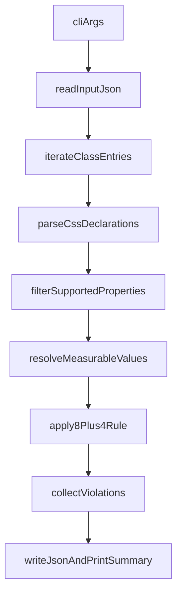

# Build `8px` CLI

## Goal

Create a publishable CLI utility with command `8px` that runs as `npx 8px --design grid --input "ui8kit.map.json" --output "ui8kit.map.backlog.json"`, reads a JSON map of `className -> CSS declarations`, validates only layout spacing values using the `8 + 4` rule, and outputs a backlog of offending classes.

## Current Repo State

The workspace currently contains only the source map file: [e:@Bunui8kit-8px-cli\ui8kit.map.json](e:_@Bun@ui8kit-8px-cli\ui8kit.map.json). The implementation therefore needs full package scaffolding in addition to the validator.

## Scope

Validate only these layout-related properties:

- `margin`, `margin-top`, `margin-right`, `margin-bottom`, `margin-left`, `margin-inline`, `margin-block`
- `padding`, `padding-top`, `padding-right`, `padding-bottom`, `padding-left`, `padding-inline`, `padding-block`
- `gap`, `row-gap`, `column-gap`
- `width`, `height`, `min-width`, `min-height`, `max-width`, `max-height`
- `top`, `right`, `bottom`, `left`, `inset`

Ignore all other properties for now, including typography, border width, radius, shadows, z-index, grid line numbers, order, and color-related declarations.

## Validation Policy

Use the practical `8 + 4` model:

- Values are valid when resolved pixel size is divisible by `8`
- `4px` is also allowed as an explicit helper step
- `0` is valid
- Non-measurable values such as `auto`, `fit-content`, `min-content`, `max-content`, `100%`, `100vh`, `100vw`, `inherit`, `initial`, `unset`, `transparent`, and variable-only expressions without a resolvable pixel result are skipped

Resolution strategy:

- Parse direct pixel values such as `12px`
- Parse `rem` values using configurable root font size, default `16`
- Parse `calc(var(--spacing) * N)` using configurable spacing base, default `4`
- Parse nested spacing expressions used by `space-x-*` and `space-y-*` by extracting the same `var(--spacing) * N` multiplier
- Do not validate arbitrary numbers that are not size units or spacing multipliers

## Planned Package Structure

Add the minimal package needed for local use and publishing:

- [e:@Bunui8kit-8px-cli\package.json](e:_@Bun@ui8kit-8px-cli\package.json): package metadata, `bin`, scripts, publish fields
- [e:@Bunui8kit-8px-cli\README.md](e:_@Bun@ui8kit-8px-cli\README.md): installation, usage, flags, examples, output format
- [e:@Bunui8kit-8px-cli\src\cli.ts](e:_@Bun@ui8kit-8px-cli\src\cli.ts): argument parsing and command entrypoint
- [e:@Bunui8kit-8px-cli\src\validate-map.ts](e:_@Bun@ui8kit-8px-cli\src\validate-map.ts): orchestration for validating one input map
- [e:@Bunui8kit-8px-cli\src\parse-css-values.ts](e:_@Bun@ui8kit-8px-cli\src\parse-css-values.ts): CSS declaration parsing and measurable value extraction
- [e:@Bunui8kit-8px-cli\src\rules.ts](e:_@Bun@ui8kit-8px-cli\src\rules.ts): allowed properties and `8 + 4` rule helpers
- [e:@Bunui8kit-8px-cli\src\types.ts](e:_@Bun@ui8kit-8px-cli\src\types.ts): shared result and config types
- [e:@Bunui8kit-8px-cli\src\format-output.ts](e:_@Bun@ui8kit-8px-cli\src\format-output.ts): console summary and backlog JSON shaping
- [e:@Bunui8kit-8px-cli\test\fixtures\ui8kit.map.json](e:_@Bun@ui8kit-8px-cli\test\fixtures\ui8kit.map.json): reusable fixture copied from the sample map
- [e:@Bunui8kit-8px-cli\test.test.ts](e:_@Bun@ui8kit-8px-cli\test*.test.ts): focused tests for parsing and reporting

## CLI Contract

Support a narrow, publishable first version:

- `--design grid`: accepted mode for this validator
- `--input <path>`: required source JSON map
- `--output <path>`: required output backlog JSON file
- `--spacing-base <number>`: optional, default `4`
- `--root-font-size <number>`: optional, default `16`
- `--verbose`: optional detailed terminal output

Expected process flow:

1. Read and parse input JSON
2. Validate only supported layout properties
3. Build a normalized report of violations
4. Print terminal summary with counts and class names
5. Write machine-readable backlog JSON to the output path
6. Exit with non-zero code when violations are found, so the tool can be used in CI later

## Backlog Output Shape

Write a stable JSON structure that is easy to diff and consume later:

- `meta`: input path, design mode, spacing base, root font size, generated timestamp, total classes scanned
- `summary`: classes checked, declarations checked, violation count
- `violations`: array of objects with `className`, `property`, `rawValue`, `resolvedPx`, and `reason`

This keeps the first version human-readable while still future-proof for CI, dashboards, or additional design modes.

## Implementation Notes

Use a property-aware validator instead of a global numeric regex sweep.

Recommended internal flow:

Key design choices:

- Parse declaration blocks line-by-line so multi-line values from media queries or utility helpers do not break scanning
- Maintain an allowlist of properties to avoid false positives from unrelated numeric CSS
- Keep validation pure and deterministic so it is easy to test with fixture maps
- Separate parsing, validation, and formatting to make future design modes possible without rewriting the CLI

## Release Readiness

Prepare the package for publication as part of the implementation:

- Add `bin` mapping for command `8px`
- Ensure the package has `name`, `version`, `description`, `license`, `files`, and entry fields needed for npm publishing
- Add scripts for build or direct Bun execution, tests, and a smoke example
- Include a README with install, local run, `npx` usage, flags, JSON output example, and expected exit codes
- Verify the CLI works end-to-end against [e:@Bunui8kit-8px-cli\ui8kit.map.json](e:_@Bun@ui8kit-8px-cli\ui8kit.map.json)

## Verification Plan

Before considering the package publish-ready:

- Run the CLI on the provided sample input and confirm the output file is generated
- Confirm known offenders such as spacing values resolving to `12px`, `20px`, or other non-`8 + 4` invalid values are reported correctly under the chosen rule set
- Confirm ignored properties do not appear in the backlog
- Confirm terminal output is concise in normal mode and detailed in `--verbose`
- Confirm exit codes distinguish success from violations and invalid usage
- Review README examples against the actual implemented flags and output

