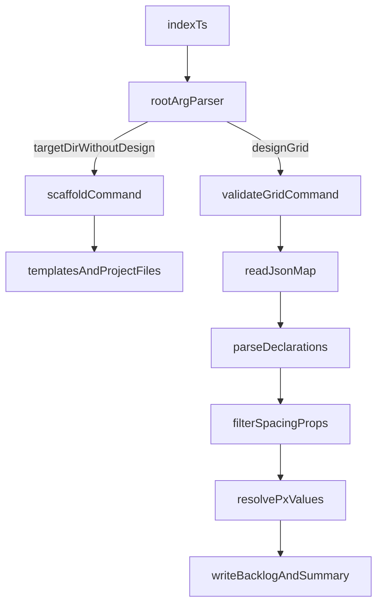

# Merge Validator Into `ui8px`

## Goal

Unify the current scaffold CLI in [.ui8px/package.json](e:_@Bun@ui8kit-8px-cli.ui8px\package.json) and the standalone 8px-grid validator in [package.json](e:_@Bun@ui8kit-8px-cli\package.json) into one publishable package named `ui8px` with one bin entry:

- scaffold mode: `npx ui8px my-app --template react-resta`
- validator mode: `npx ui8px --design grid --input "ui8kit.map.json" --output "ui8kit.map.backlog.json"`

## Source Of Truth

Make `.ui8px` the canonical implementation package because it already has the publishable npm metadata, TypeScript build pipeline, and `bin: ui8px` entry:

- [.ui8px/package.json](e:_@Bun@ui8kit-8px-cli.ui8px\package.json)
- [.ui8px/src/index.ts](e:_@Bun@ui8kit-8px-cli.ui8px\src\index.ts)
- [.ui8px/tsconfig.json](e:_@Bun@ui8kit-8px-cli.ui8px\tsconfig.json)
- [.ui8px/tsconfig.build.json](e:_@Bun@ui8kit-8px-cli.ui8px\tsconfig.build.json)

Treat the current root validator package as temporary implementation to be migrated, then remove or archive its duplicate package surface:

- [package.json](e:_@Bun@ui8kit-8px-cli\package.json)
- [src/cli.js](e:_@Bun@ui8kit-8px-cli\src\cli.js)
- [src/validate-map.js](e:_@Bun@ui8kit-8px-cli\src\validate-map.js)
- [src/parse-css-values.js](e:_@Bun@ui8kit-8px-cli\src\parse-css-values.js)
- [src/rules.js](e:_@Bun@ui8kit-8px-cli\src\rules.js)
- [src/format-output.js](e:_@Bun@ui8kit-8px-cli\src\format-output.js)

## CLI Design

Keep one root parser in [.ui8px/src/index.ts](e:_@Bun@ui8kit-8px-cli.ui8px\src\index.ts), but split behavior into two modes:

- `scaffold mode`: selected when a positional target directory is present and `--design` is absent
- `validation mode`: selected when `--design grid` is provided

Priority rules:

- If `--design` is present, run validator mode
- Otherwise preserve the current scaffold behavior exactly
- Reject ambiguous combinations, such as mixing scaffold-only flags with validator-only required arguments in invalid ways

## Refactor Architecture

Extract the current monolithic scaffold file into small mode-specific modules, then plug the validator beside it.

Recommended target structure inside `.ui8px/src/`:

- `index.ts`: lightweight entrypoint and mode dispatch
- `cli/parse-args.ts`: shared root argument parsing and mode selection
- `commands/scaffold.ts`: current app generation workflow from `src/index.ts`
- `commands/validate-grid.ts`: migrated validator runner
- `validate-grid/validate-map.ts`: map validation orchestration
- `validate-grid/parse-css-values.ts`: measurable value extraction
- `validate-grid/rules.ts`: allowed properties and `8 + 4` rule helpers
- `validate-grid/format-output.ts`: console summary and backlog JSON shaping
- `validate-grid/types.ts`: report/config interfaces

## Validator Migration

Port the existing JS validator logic into TypeScript under `.ui8px`, preserving the same behavior already proven in the current root implementation:

- validate only spacing/layout properties
- use the `8 + 4` rule
- support `px`, `rem`, and `calc(var(--spacing) * N)`
- write JSON backlog report and non-zero exit code on violations

Use the current implementation as migration source, not as final structure:

- [src/cli.js](e:_@Bun@ui8kit-8px-cli\src\cli.js)
- [src/validate-map.js](e:_@Bun@ui8kit-8px-cli\src\validate-map.js)
- [src/parse-css-values.js](e:_@Bun@ui8kit-8px-cli\src\parse-css-values.js)
- [src/rules.js](e:_@Bun@ui8kit-8px-cli\src\rules.js)
- [src/format-output.js](e:_@Bun@ui8kit-8px-cli\src\format-output.js)

## Compatibility Rules

Preserve existing `ui8px` scaffold UX from [.ui8px/src/index.ts](e:_@Bun@ui8kit-8px-cli.ui8px\src\index.ts):

- `npx ui8px my-app`
- `npx ui8px my-app --template react-resta`
- `npx ui8px my-app --immediate`

Add validator UX as root flags:

- `npx ui8px --design grid --input "ui8kit.map.json" --output "ui8kit.map.backlog.json"`
- optional `--spacing-base`, `--root-font-size`, `--verbose`

Update help output so both modes are documented clearly from one command.

## Package Consolidation

Consolidate npm metadata around `.ui8px/package.json`:

- keep `name: ui8px`
- keep `bin.ui8px = ./dist/index.js`
- extend `keywords`, `description`, and README to cover both scaffolding and 8px-grid validation
- ensure published `files` include templates and compiled validation code
- keep `prepublishOnly` build checks working for both modes

After migration, resolve duplication at repo root:

- either remove the root standalone package files from publish consideration
- or turn the root into a workspace shell/documentation layer only

The key outcome is that only one package is publishable.

## Documentation Update

Replace the current single-purpose docs with one unified README in [.ui8px/README.md](e:_@Bun@ui8kit-8px-cli.ui8px\README.md):

- scaffold usage
- validator usage
- supported validator scope
- output JSON format
- exit codes
- publish instructions using `npm publish --access=public`

Also decide whether the root [README.md](e:_@Bun@ui8kit-8px-cli\README.md) becomes:

- a short repo-level overview pointing to `.ui8px`, or
- a copy/symlink-equivalent of the canonical package docs

## Verification Plan

Before considering the refactor complete:

- build `.ui8px` and confirm `dist/index.js` supports both modes
- run scaffold smoke test with an empty target directory
- run validator smoke test on [ui8kit.map.json](e:_@Bun@ui8kit-8px-cli\ui8kit.map.json)
- confirm generated backlog JSON still reports the known violations correctly
- confirm help text documents both scaffold and validator modes
- confirm package metadata publishes under `ui8px` without the previous naming issue

## Cleanup

Once the merged CLI is verified:

- remove obsolete duplicated validator-only runtime files from the root package, or clearly archive them to avoid future drift
- ensure there is one canonical implementation path for CLI behavior
- ensure no docs still reference `npx 8px` as the primary command

